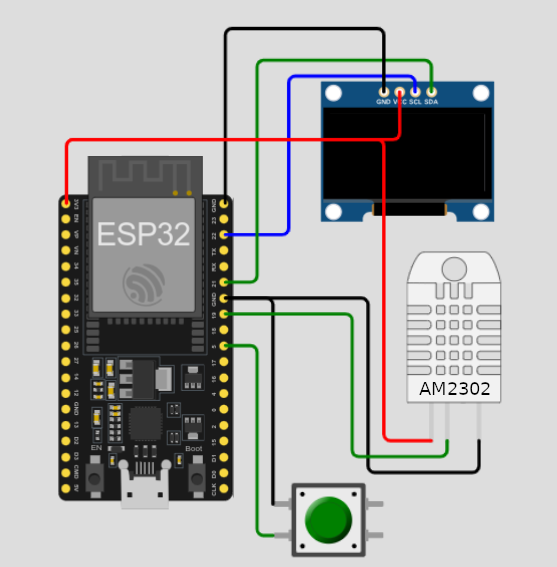
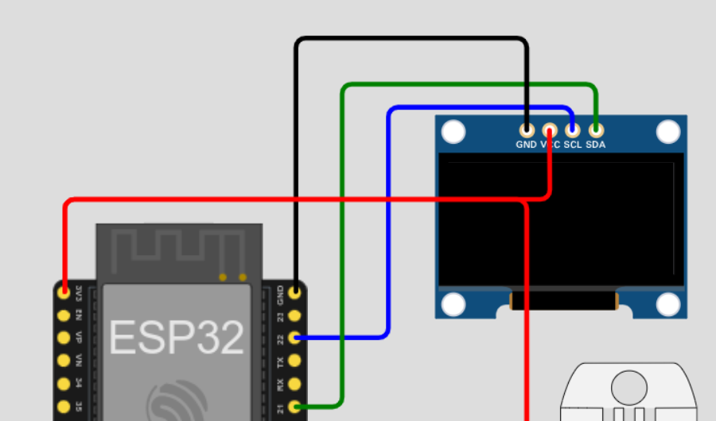
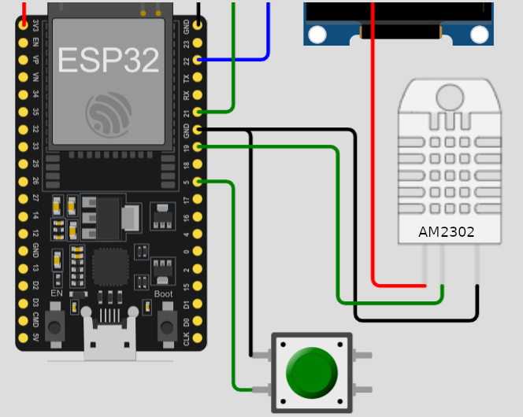
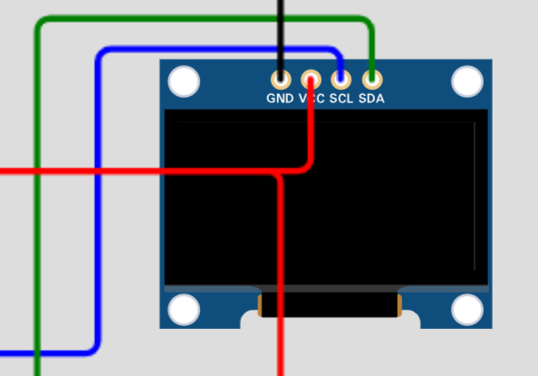

# Temperature and Humidity Monitoring with ESP32 and AM2302 Sensor

This project is an experiment utilizing an **ESP32** as the central microcontroller to read temperature and humidity data from an **AM2302 (DHT22)** sensor and display this data on a **monochromatic OLED screen** via an **I2C** interface. The sensor data is sent to an **MQTT** server for remote processing or display. This repository is part of a larger project exploring the viability of using FHIR in IoT (Internet of Things) device interactions.

## Main Components

- **ESP32:** Microcontroller with WiFi capabilities for connection and peripheral control.
- **OLED Display:** Monochromatic display to show temperature, humidity, and received messages.
- **AM2302 (DHT22) Sensor:** A high-accuracy, fast-response temperature and humidity sensor.

## Project Electronic Schematics

Below are three representative images of the electronic schematic used in this project. These images illustrate how the ESP32 is connected to the OLED screen and the AM2302 sensor, along with other relevant components, pin numbers, etc.,
In red, the wires powered at 3.3v, in black, those connected to ground, in green the data wires, and in blue the wire connected to the clock signal.


*Electronic Schematic 1: Overview of the system*



*Electronic Schematic 3: Detail of the OLED screen connection to the ESP32*


*Electronic Schematic 4: Pins of the OLED*


*Electronic Schematic 5: Connections of the humidity sensor and button to the ESP32*

## ESP32 Reference

For more technical details and specifications of the used ESP32 microcontroller, please consult the following links to the reference PDF. It's advisable to review this document to better understand the capabilities and limitations of the ESP32 used in this project since a development board was used for rapid prototyping.


[Development board reference - PDF](doc/nodemcu-32s_product_specification.pdf "Node-MCU32S Reference")

[ESP32 Reference - PDF](doc/esp32_datasheet_en.pdf "ESP32 Reference")


## Libraries Used

- `WiFi.h`: For WiFi network connection.
- `PubSubClient.h`: MQTT client for ESP32.
- `Adafruit_GFX.h` and `Adafruit_SSD1306.h`: To control the OLED display.
- `DHT.h` and `DHT_U.h`: To read data from the AM2302 sensor.
- `ArduinoJson.h`: To create and parse JSON messages.

## Functionality

1. **WiFi Connection:** The ESP32 connects to a specified WiFi network.
2. **Sensor Data Reading:** Periodically reads temperature and humidity data from the AM2302 sensor.
3. **Display on OLED Screen:** Displays the read data and messages received by MQTT on the OLED screen.
4. **Data Sending via MQTT:** Sends data in JSON format to an MQTT broker for further analysis or display.

## Example of `credentials.h` File

To work you need to add this file inside src folder, and it should define the WiFi network credentials and the MQTT broker information:

```cpp
// credentials.h
#ifndef CREDENTIALS_H
#define CREDENTIALS_H

const char* ssid = "your_wifi_ssid";        // Your WiFi SSID
const char* password = "your_wifi_password";  // Your WiFi password
const char* mqtt_server = "192.168.1.100";    // MQTT server address
const char* mqtt_user = "user";              // MQTT server username
const char* mqtt_password = "password";      // MQTT server password
```

Make sure to replace the values with your own credentials and MQTT server address.

## Implementation
- **Development Environment:** Visual Studio Code and the Platformio plugin were used to deploy the code onto the nodemcu development board, but this process can also be performed with any other IDE supporting ESP32s development boards.
- **Control Button:** A button connected to the ESP32 allows the user to manually request sensor data reading and send this data via MQTT.
- **MQTT Connection:** The MQTT connection remains active, and in case of disconnection, the system attempts to reconnect automatically.

## Security and Potential Improvements
- **MQTT Security:** Ensure the MQTT connection is secure by considering protocols like SSL/TLS. In our case, we first set up a Mosquitto server and then a RabbitMQ server with the MQTT plugin activated. For more details on this implementation, you can refer to the root project of this repository.
- **Error Handling:** Implementing robust error handling is a necessary improvement if any of this code is to be moved into production. It should even be a requirement in the implementation of any medical device that uses any of these technologies.


# Monitorización de temperatura y huedad con ESP32 y Sensor AM2302

Este proyecto es un experimento que utiliza un **ESP32** como microcontrolador central para leer datos de temperatura y humedad de un sensor **AM2302 (DHT22)** y mostrar estos datos en una pantalla **OLED monocromática** a través de una interfaz **I2C**. Los datos del sensor se envían a un servidor **MQTT** para su procesamiento o visualización remota. Este repositorio forma parte de un proyecto más grande que trata de abordar la viabilidad de usar FHIR en interacciones con dispositivos de IOT (Internet de las Cosas).

## Componentes Principales

- **ESP32:** Microcontrolador con capacidades WiFi para la conexión y control de periféricos.
- **Pantalla OLED:** Display monocromático para mostrar la temperatura, humedad y mensajes recibidos.
- **Sensor AM2302 (DHT22):** Sensor de temperatura y humedad con una precisión alta y una respuesta rápida.

## Esquemas Electrónicos del Proyecto

A continuación, se muestran tres imágenes representativas del esquema electrónico utilizado en este proyecto. Estas imágenes ilustran cómo se conectan el ESP32, la pantalla OLED y el sensor AM2302, así como cualquier otro componente relevante, número de los pines usados etc.,
En rojo, los cables alimentados a 3.3v, en negro, los conectados a tierra, en verde los de datos y en azul el cable conectado a señal de reloj.


*Esquema Electrónico 1: Vista general del sistema*


*Esquema Electrónico 2: Detalle de la conexión de la pantalla oled conectado al ESP32*


*Esquema Electrónico 4: Pines de la pantalla OLED*


*Esquema Electrónico 5: Conexiones del sensor de humedad y el botón al ESP 32*

## Referencia del ESP32

Para más detalles técnicos y especificaciones del microcontrolador ESP32 usado, consulta el siguiente enlace al PDF de referencia. Es recomendable revisar este documento para entender mejor las capacidades y limitaciones del ESP32 utilizado en este proyecto puesto que se utilizó una placa de desarrollo para realizar un prototipado rápido.

[Referencia ESP32 - PDF](doc/esp32_datasheet_en.pdf.pdf "Referencia ESP32")

[Referencia Placa de Desarrollo NodeMCU - PDF](doc/nodemcu-32s_product_specification.pdf "Referencia Node-MCU32S")


## Librerías Utilizadas

- `WiFi.h`: Para la conexión a redes WiFi.
- `PubSubClient.h`: Cliente MQTT para ESP32.
- `Adafruit_GFX.h` y `Adafruit_SSD1306.h`: Para controlar la pantalla OLED.
- `DHT.h` y `DHT_U.h`: Para leer los datos del sensor AM2302.
- `ArduinoJson.h`: Para crear y parsear mensajes JSON.

## Funcionalidad

1. **Conexión WiFi:** El ESP32 se conecta a una red WiFi especificada.
2. **Lectura de datos del sensor:** Se leen periódicamente los datos de temperatura y humedad del sensor AM2302.
3. **Visualización en pantalla OLED:** Se muestran los datos leídos y los mensajes recibidos por MQTT en la pantalla OLED.
4. **Envío de datos mediante MQTT:** Los datos se envían en formato JSON a un broker MQTT para su posterior análisis o visualización.

## Ejemplo de Archivo de Credenciales `credentials.h`

Este archivo debe definir las credenciales de la red WiFi y la información del broker MQTT:

```cpp
// credentials.h
#ifndef CREDENTIALS_H
#define CREDENTIALS_H

const char* ssid = "cocoanuts-WiFi";          // Tu SSID de WiFi
const char* password = "myWifiPass";    // Tu contraseña de WiFi
const char* mqtt_server = "192.168.1.160";  // Dirección del servidor MQTT
const char* mqtt_user = "user";    // Usuario para el servidor MQTT
const char* mqtt_password = "password";  // Contraseña para el servidor MQTT
```

Asegúrate de reemplazar los valores con tus propias credenciales y dirección del servidor MQTT.

## Implementación
- **Entorno de desarrollo:** Se usó Visual Studio Code y el pluggin Platformio para desplegar el código sobre la placa de desarrollo nodemcu, pero este proceso también puede realizarse con cualquier otro IDE que admita placas de desarrollo ESP32s. 
- **Botón de Control:** Un botón conectado al ESP32 permite al usuario solicitar manualmente la lectura de datos del sensor y enviar estos datos a través de MQTT.
- **Conexión MQTT:** La conexión MQTT se mantiene activa y en caso de desconexión, el sistema intenta reconectarse automáticamente.

## Seguridad y posibles Mejoras
- **Seguridad MQTT:** Asegúrate de que la conexión MQTT esté segura, considerando el uso de protocolos como SSL/TLS si es posible. En nuestro caso levantamos primero un servidor Mosquitto y posteriormente, un servidor rabbitmq con el plugin mqtt activado, para obtener más detalles de esta implementación puedes acudir al proyecto raíz de este repositorio.
- **Manejo de Errores:** Implementar un manejo de errores robusto para garantizar que el sistema funcione de manera continua y fiable es una mejora necesaria si se va a llevar algo de este código a producción. Incluso debe de ser un requisito en la implementación de cualquier dispositivo médico que utilice cualquiera de estas tecnologías.
